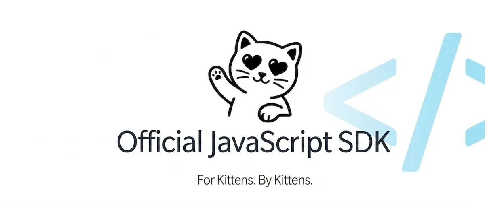
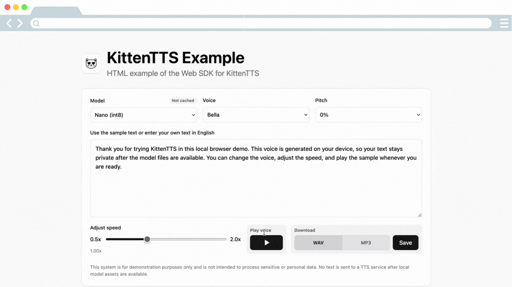

# KittenTTS Web

<p align="center">
  
</p>

<p align="center">
  Web and Node.js SDK for on-device KittenTTS speech synthesis.
  <br />
  Generate speech in browsers and Node.js without sending text to a cloud TTS API.
</p>

<p align="center">
  <a href="https://huggingface.co/spaces/KittenML/KittenTTS-Demo"></a>
  <a href="https://discord.com/invite/VJ86W4SURW"></a>
  <a href="https://kittenml.com"></a>
  <a href="https://github.com/KittenML/KittenTTS-web"></a>
  <a href="LICENSE"></a>
  
</p>

> Developer preview. APIs may change between releases.

> Browser apps use ONNX Runtime Web and browser storage. Node.js apps use ONNX
> Runtime Web with filesystem storage by default.

> Browser ONNX Runtime wasm assets are loaded from the matching ONNX Runtime Web
> CDN by default. For production apps that need CDN independence or stricter
> supply-chain controls, self-host those ONNX Runtime assets and set
> `ortWasmPath`.

## See It In Action

<p align="center">
  
</p>

<p align="center">
  <strong>Web</strong> · Plain HTML example with local speech generation and playback
</p>

---

## What Is KittenTTS Web?

KittenTTS Web lets you add local speech synthesis to browser and Node.js apps:

- **Text-to-speech** - neural voice synthesis from plain text.
- **On-device inference** - powered by KittenTTS and ONNX Runtime Web.
- **Private by default** - no cloud TTS request after assets are available.
- **Offline-ready** - download once into browser or filesystem cache, or provide
  preloaded model bytes.
- **App-friendly output** - play audio directly, save WAV or MP3 data, stream longer
  text, or use generated word timings for read-aloud UI.

No cloud. No API key. No text leaving the device for speech generation.

---

The SDK sends anonymous generation analytics; see [Getting started](docs/getting-started.md#analytics) for details and opt-out.

## SDK

| Runtime | Status | Docs |
| --- | --- | --- |
| Browser | Developer preview | [Getting started](docs/getting-started.md#browser) |
| Node.js | Developer preview | [Getting started](docs/getting-started.md#nodejs) |
| Plain HTML example | Supported | [HTML example](examples/html) |
| Vite React example | Supported | [Vite React example](examples/vite-react) |
| Node Express example | Supported | [Node Express example](examples/node-express) |

Install:

```bash
npm install @kittentts/web
```

---

## Quick Start

Install the SDK:

```bash
npm install @kittentts/web
```

Generate audio in memory:

```ts
import { KittenTTS } from '@kittentts/web';

const tts = await KittenTTS.create(
  {
    model: 'nano-int8',
  },
  (progress) => {
    console.log(`setup ${Math.round(progress * 100)}%`);
  },
);

const result = await tts.generate('Hello from KittenTTS on the web.');

console.log(result.sampleRate);
console.log(result.wavBase64());
console.log(await result.mp3Base64());

await tts.dispose();
```

Play audio in a browser:

```ts
import {
  KittenTTS,
  createBrowserAudioPlayer,
} from '@kittentts/web';

const tts = await KittenTTS.create({
  player: createBrowserAudioPlayer(),
});

await tts.speak('This voice is generated in the browser.');
```

Generate audio in Node.js:

```ts
import { writeFile } from 'node:fs/promises';
import { KittenTTS } from '@kittentts/web';

const tts = await KittenTTS.create({
  model: 'nano-int8',
});

const result = await tts.generate('Generated in Node.js.');
await writeFile('speech.wav', result.wavData());
await writeFile('speech.mp3', await result.mp3Data());
await tts.dispose();
```

[Full getting started guide →](docs/getting-started.md)

---

## Browser Setup

Browser apps can use the SDK directly from a frontend bundle:

```ts
import {
  KittenTTS,
  createBrowserAudioPlayer,
} from '@kittentts/web';

const tts = await KittenTTS.create({
  player: createBrowserAudioPlayer(),
});
```

The SDK configures ONNX Runtime Web wasm assets automatically. Pass
`ortWasmPath` when you need to self-host those files.

The plain HTML example can also be opened directly from the filesystem:

```bash
npm run example:html
```

Open `http://127.0.0.1:5173`, or open `examples/html/index.html` directly in a
browser. Direct `file://` usage falls back to in-memory asset storage, so a
refresh may download model assets again.

---

## Sample Apps

- [`examples/html`](examples/html) - static HTML, CSS, and JavaScript setup.
- [`examples/vite-react`](examples/vite-react) - Vite React browser setup.
- [`examples/vite-react-word-timings`](examples/vite-react-word-timings) - word highlighting with generated timings.
- [`examples/node-express`](examples/node-express) - Node Express backend-to-browser playback.

---

## Features

- [On-device TTS inference](docs/getting-started.md) in browsers and Node.js.
- [Model download and cache](docs/reference/api.md#cache-helpers) with progress callbacks.
- [Offline assets](docs/guides/offline-assets.md) for apps that cannot depend on a first-run download.
- [Playback helpers](docs/guides/playback.md) for browser audio and custom audio layers.
- WAV and MP3 output from generated raw PCM samples.
- [Word timings](docs/guides/word-timings.md) for read-aloud highlighting.
- [Streaming generation](docs/reference/api.md#stream) for longer text.

---

## Supported Models

Start with `nano-int8` for the smallest download. Use larger models when quality
matters more than size.

| Model | ID | Parameters | Approx download | Use case |
| --- | --- | --- | --- | --- |
| Nano int8 | `'nano-int8'` | 15M | 25 MB | Smallest app/download size |
| Nano fp32 | `'nano'` | 15M | 56 MB | Nano quality without quantization |
| Micro | `'micro'` | 40M | 41 MB | Better quality, still compact |
| Mini | `'mini'` | 80M | 80 MB | Highest quality option |

[Models and voices →](docs/reference/models.md)

## Voices

```text
Bella, Jasper, Luna, Bruno, Rosie, Hugo, Kiki, Leo
```

```ts
await tts.speak('Luna speaking.', { voice: 'luna' });
await tts.speak('Slower Bruno speaking.', { voice: 'bruno', speed: 0.85 });
```

---

## Docs

- [Docs overview](docs/README.md)
- [Getting started](docs/getting-started.md)
- [Playback](docs/guides/playback.md)
- [Offline assets](docs/guides/offline-assets.md)
- [Word timings](docs/guides/word-timings.md)
- [Models and voices](docs/reference/models.md)
- [API reference](docs/reference/api.md)
- [Troubleshooting](docs/troubleshooting.md)
- [Development](docs/development.md)

Examples:

- [Plain HTML example](examples/html)
- [Vite React example](examples/vite-react)
- [Vite React word timings example](examples/vite-react-word-timings)
- [Node Express example](examples/node-express)

---

## System Requirements

- Node.js `20+`
- Modern browser with WebAssembly support for browser apps
- Network access to Hugging Face for first-run model downloads, unless assets
  are preloaded or self-hosted

Runtime dependencies installed by the SDK:

- `onnxruntime-web`
- `pako`

Audio playback is optional. Use `createBrowserAudioPlayer()` in browsers or pass
a custom `AudioPlayer`. Use `tts.createPlaybackQueue()` when multiple generated
clips should play in order instead of interrupting each other.

---

## Roadmap

- Add more streaming playback examples.
- Add more browser storage and offline asset examples.
- Continue tracking ONNX Runtime Web compatibility across browsers and Node.js.
- Support future KittenTTS model releases as they become available.

Need something specific? [Open an issue](https://github.com/KittenML/KittenTTS-web/issues).

---

## Community And Support

- Website: [kittenml.com](https://kittenml.com/)
- Repository: [KittenML/KittenTTS-web](https://github.com/KittenML/KittenTTS-web)
- Discord: [Join the community](https://discord.com/invite/VJ86W4SURW)
- Demo: [Hugging Face Spaces](https://huggingface.co/spaces/KittenML/KittenTTS-Demo)
- Issues: [GitHub Issues](https://github.com/KittenML/KittenTTS-web/issues)
- Commercial support: [contact form](https://docs.google.com/forms/d/e/1FAIpQLSc49erSr7jmh3H2yeqH4oZyRRuXm0ROuQdOgWguTzx6SMdUnQ/viewform?usp=preview)

## Commercial Support

Commercial support is available for teams integrating KittenTTS into their
products, including integration assistance, custom voice development, and
enterprise licensing.

[Contact us](https://docs.google.com/forms/d/e/1FAIpQLSc49erSr7jmh3H2yeqH4oZyRRuXm0ROuQdOgWguTzx6SMdUnQ/viewform?usp=preview)
or email info@stellonlabs.com to discuss your requirements.

## License

Apache 2.0. See [LICENSE](./LICENSE).

## Disclaimers

KittenTTS Web is a developer preview and APIs may change between releases.
Generated speech quality, pronunciation, timing metadata, and playback behavior
can vary by model, browser, device, and runtime. Review generated audio before
using it in production workflows.

The SDK runs speech generation locally after assets are available. Anonymous
generation analytics are enabled by default and can be disabled with
`analytics: false`.
